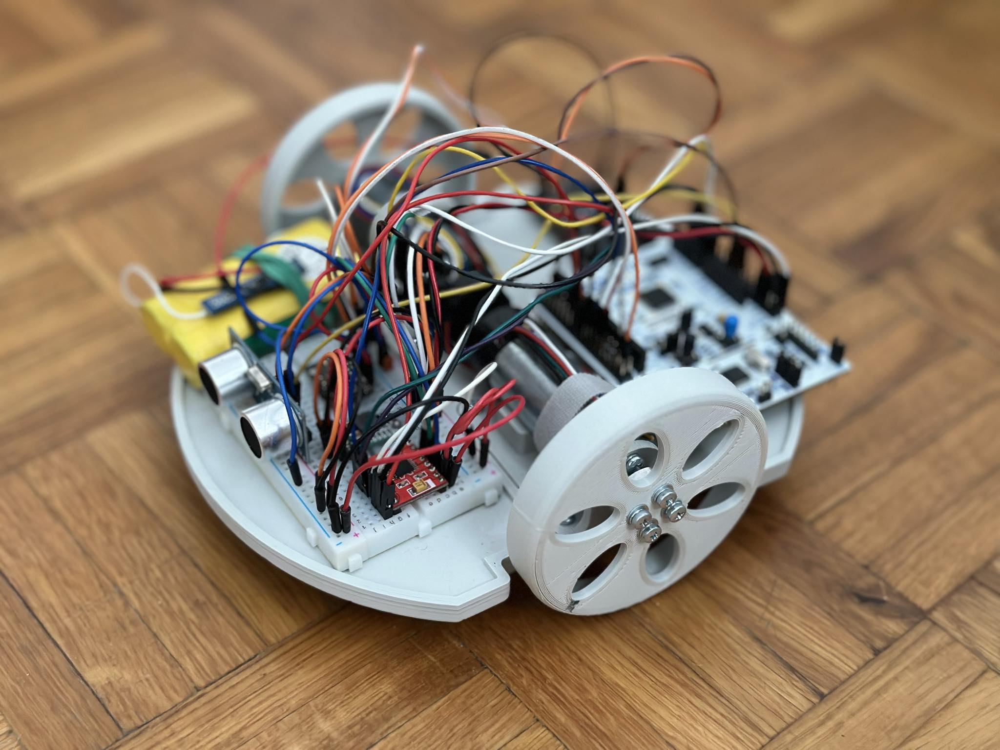

# DiffDrive Project Overview

## Description
This is the software designated for the differential drive robot made as a part of the robotics course. It is controlled by a desktop graphical application
made in Qt (https://github.com/Rooteq/DiffSight).

## Hardware
This robot is composed of 3D printed mobile platform, 2 DC motors with encoders, Nucleo STM32F476RG board, 
ESP32 board, H brige, HC-SR04 ultrasonic sensor and MPU6050 IMU. Schematics are located in [Mechanics](https://github.com/Rooteq/DiffSight) folder

## Key Features
- **Odometry** The robot can localize itself by fusing data from the encoders and the IMU.
- **Automatic control** By setting the destination point, robot will reach it by its own.
- **Manual control** The robot can be steered by using keyboard arrows or the GUI.
- **Obstacle detection and marking** When the robot sees the obstacle in front of it, it marks it as a dot in the graphical interface.
- **WebSocket communication** The range of the robot is as good as the WIFI signal is.

## Implemented features
- **Motor PIDs:** Precise speed control.
- **Complementary filter:** Better estimation of position vector by fusing data from the encoders and the IMU.
- **Position controllers:** The robot can autonomically reach its destination with the help of 2 PI controllers.
- **UART communication between controllers:** Custom frame with CRC is used to exchange data between STM32 and ESP32.

## Assembled robot
Assembled robot looks like this:
